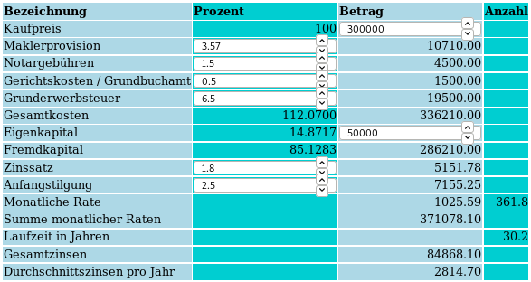

# ImmoAnnuRechner
Immobilienfinanzierung per Annuitätendarlehen berechnen.

Veränderbare Eingaben sind:

- Kaufpreis.
- Diverse Nebenkosten (%).
- Eigenkapital.

=> Damit wird das benötigte Fremdkapital berechnet.

- Zinssatz (%).
- Anfangstilgung (%).

=> Dadurch werden dann die restlichen Ergebnisse berechnet, u.a.:

- Monatliche Rate.
- Laufzeit.
- Gesamtzinsen.

"Klickt" man sich aus einem Eingabefeld "heraus",
werden alle Werte automatisch erneut berechnet (also aktualisiert).

[Hier geht es zum ImmoAnnuRechner.](https://rhinodevel.github.io/ImmoAnnuRechner/)
